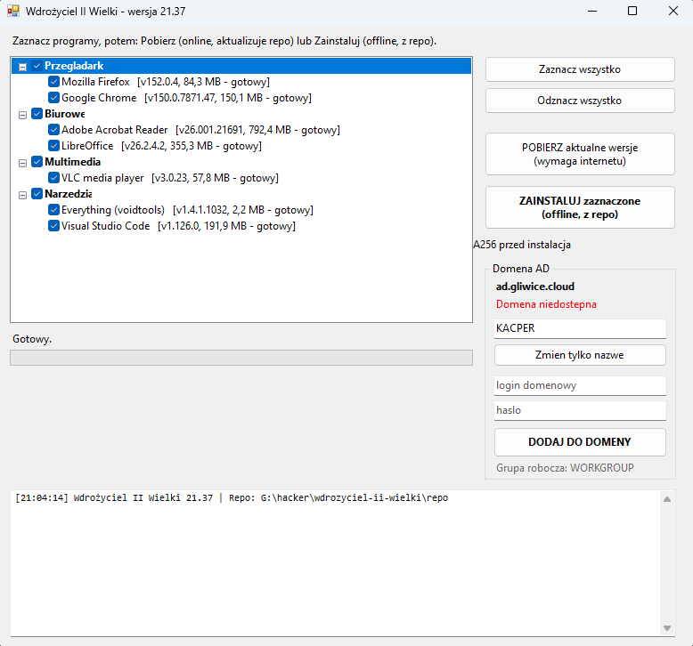

<div align="center">


# Wdrożyciel II Wielki

**Offline'owy instalator, zestaw narzędzi administracyjnych i dołączanie do domeny AD — w jednym `.exe`, bez zależności.**

[](#wymagania)
[](#budowanie-ze-źródeł)
[](LICENSE)
[](CHANGELOG.md)
[](#dlaczego-ii-wielki)

</div>

---

## Co to jest

**Wdrożyciel II Wielki** to jednoplikowa aplikacja WinForms (.NET Framework 4.x) do
**przygotowania świeżego komputera z Windows do pracy** — instalacji zestawu programów
(również **całkowicie offline**, z lokalnego repozytorium), sprzątania fabrycznych
śmieci i dołączenia stacji do domeny Active Directory.

Zamiast klikać przez kilkanaście instalatorów, zaznaczasz programy, klikasz jeden
przycisk i idziesz po kawę. Cała logika mieści się w jednym `Program.cs` i jednym
`.exe` bez instalatora — kopiujesz folder na pendrive i działa.

> [!WARNING]
> Aplikacja wymaga uprawnień administratora i wykonuje operacje o dużym zasięgu:
> instalacje maszynowe, zmiany w `HKLM`, planach zasilania i pakietach Appx,
> usuwanie Office oraz dołączanie do domeny. **Uruchamiaj świadomie i najlepiej
> najpierw na maszynie testowej.** Zobacz [Bezpieczeństwo](#bezpieczeństwo).

## Zrzut ekranu

<div align="center">

</div>

## Funkcje

### 📦 Instalacja programów (online i offline)
- Zaznaczasz aplikacje na liście i wybierasz **Pobierz** (online, buduje lokalne repo)
  albo **Zainstaluj** (offline, z repo) — instalacje są **maszynowe** (`machine`).
- Pobieranie przez `winget` z **odpornymi ścieżkami awaryjnymi** (bez locale, scope,
  architektury) oraz opcjonalnym **bezpośrednim adresem producenta**.
- Weryfikacja **sum SHA-256**, dopisywanie `ALLUSERS=1` dla MSI, skróty na
  **publicznym pulpicie**, polityki auto-aktualizacji i Maintenance Service dla Firefoksa.
- **Pomijanie** aplikacji już zainstalowanych w tej samej lub nowszej wersji.

### 🚀 Przygotuj komputer (offline) — jeden przycisk
Cały podstawowy przebieg naraz: opcjonalne wyłączenie szybkiego uruchamiania →
instalacja zaznaczonych programów wyłącznie z lokalnego repo → opcjonalne wyczyszczenie
fabrycznego Office → otwarcie Windows Update. Przed startem sprawdzana jest kompletność plików.

### 🛠️ Narzędzia administracyjne
- Zrzut `winget list` do logu i **ciche odinstalowanie** wskazanych ID.
- **Usuwanie pakietów Appx** dla wszystkich obecnych oraz nowych użytkowników (provisioned).
- Ustawienie **maksymalnego stanu procesora 100%** (AC/DC) we wszystkich planach zasilania.
- Wyłączenie **szybkiego uruchamiania** (`HiberbootEnabled=0`).
- **OfficeScrubber** (weryfikowany SHA-256) — tryb zalecany dla fabrycznego Office lub pełne czyszczenie.
- Pobranie i uruchomienie **McAfee MCPR**.

### 🧩 Lokalne skrypty PowerShell
Wrzucasz `*.ps1` do folderu [`scripts/`](scripts/), a aplikacja pokazuje je na liście
i uruchamia z uprawnieniami administratora. W zestawie bezpieczny przykład.

### 🏢 Domena Active Directory
Zmiana nazwy komputera i **dołączenie do domeny** (z potwierdzeniem nietypowej nazwy),
z propozycją restartu po zakończeniu.

## Wymagania

| | |
|---|---|
| **System** | Windows 10 / 11 (x64), także 8.1 |
| **Uprawnienia** | Administrator (manifest `requireAdministrator`) |
| **Runtime** | .NET Framework 4.x (wbudowany w Windows) |
| **Opcjonalnie** | `winget` (App Installer) do trybu online |

## Szybki start

### 1. Pobierz gotowy plik
Weź `Wdrozyciel.exe` z zakładki [**Releases**](../../releases) lub zbuduj go samodzielnie
(zobacz [Budowanie](#budowanie-ze-źródeł)).

### 2. Zbierz repozytorium offline (na komputerze z internetem)
1. Uruchom aplikację, zaznacz programy i kliknij **POBIERZ aktualne wersje**.
2. Instalatory trafią do ukrytego katalogu `.wdrozyciel\repo`, a sumy SHA-256 i metadane
   do `.wdrozyciel\manifest.json`.
3. Skopiuj **cały folder** na pendrive lub udział sieciowy — razem z ukrytym `.wdrozyciel`.

### 3. Wdróż na docelowym komputerze (offline)
1. Uruchom aplikację **jako administrator**.
2. Kliknij **ZAINSTALUJ zaznaczone** albo **PRZYGOTUJ KOMPUTER (offline)** dla pełnego przebiegu.

## Tryb CLI (bez GUI)

```bat
:: pobierz wszystkie skonfigurowane programy do lokalnego repo
Wdrozyciel.exe /download

:: pobierz tylko wybrane (po id z apps.json)
Wdrozyciel.exe /download firefox,vlc,7zip
```

## Konfiguracja

| Plik | Rola |
|------|------|
| [`apps.json`](apps.json) | Lista programów: `wingetId`, argumenty instalatora, `directUrl`, skróty, `postInstall`. |
| [`winget-remove-defaults.txt`](winget-remove-defaults.txt) | Domyślne ID do cichego odinstalowania przez `winget uninstall`. |
| [`appx-remove-defaults.txt`](appx-remove-defaults.txt) | Maski pakietów Appx do usunięcia. |
| [`scripts/`](scripts/) | Twoje skrypty `*.ps1` (nazwa pliku = nazwa na liście). |
| [`tools/`](tools/) | Dołączone narzędzia administracyjne (m.in. OfficeScrubber). |

> Dane robocze (lokalne repo instalatorów, logi, `manifest.json` oraz efektywne `apps.json`,
> `scripts/` i `tools/`) aplikacja trzyma w **ukrytym katalogu `.wdrozyciel` obok `Wdrozyciel.exe`**.
> Pliki widoczne w repozytorium to szablony i domyślna zawartość — trzymaj cały folder razem
> podczas wdrożenia offline.

Programy korzystające z `winget` pobierane są **bez numeru wersji** (bieżący manifest
katalogu). Krita jest celowo przypięta do instalatora **5.3.2.1**.

## Budowanie ze źródeł

Na Windowsie wystarczy dwuklik:

```bat
BUILD.cmd            :: kompiluje Wdrozyciel.exe do katalogu głównego
BUILD_AND_RUN.cmd    :: kompiluje i od razu uruchamia
```

Skrypt [`src/build.cmd`](src/build.cmd) używa kompilatora `csc.exe` z .NET Framework 4.x,
osadza ikonę [`src/wdrozyciel.ico`](src/wdrozyciel.ico) i manifest `requireAdministrator`.
Nie potrzebujesz Visual Studio.

**Automatyczny build:** [`.github/workflows/build-windows.yml`](.github/workflows/build-windows.yml)
buduje `.exe` na `windows-latest` i publikuje go jako artefakt (opcjonalnie podpisuje,
gdy ustawisz sekrety `SIGN_PFX_BASE64` i `SIGN_PFX_PASSWORD`).

### Podpisywanie
Podpis Authenticode jest opcjonalny — szczegóły w [`docs/SIGNING.md`](docs/SIGNING.md).
Repozytorium **nie zawiera** żadnego prywatnego certyfikatu.

## Bezpieczeństwo

To narzędzie z założenia robi rzeczy, których zwykły program robić nie powinien —
dlatego traktuj je jak skrypt administracyjny, a nie jak zwykłą aplikację:

- Uruchamia się **z podniesionymi uprawnieniami** i wykonuje instalacje maszynowe.
- **Zawsze przeglądaj** skrypty `.ps1`, które wrzucasz do `scripts/`, zanim je odpalisz.
- OfficeScrubber i usuwanie Appx potrafią **nieodwracalnie usunąć** oprogramowanie i pakiety.
- Testuj na maszynie zastępczej przed użyciem produkcyjnym.

Znalazłeś lukę? Zajrzyj do [`SECURITY.md`](SECURITY.md).

## Struktura repozytorium

```
Wdrozyciel-II-Wielki/
├─ src/                       # kod źródłowy (Program.cs), manifest, ikona, skrypty build/sign
├─ scripts/                   # lokalne skrypty PowerShell (*.ps1)
├─ tools/                     # dołączone narzędzia administracyjne (OfficeScrubber)
├─ docs/                      # dokumentacja, zrzuty ekranu, raporty
├─ assets/                    # grafiki README
├─ apps.json                  # lista programów do instalacji
├─ winget-remove-defaults.txt # domyślne ID winget do usunięcia
├─ appx-remove-defaults.txt   # domyślne maski Appx do usunięcia
├─ manifest.json              # metadane lokalnego repo offline (generowane)
├─ BUILD.cmd / BUILD_AND_RUN.cmd
├─ CHANGELOG.md
└─ README.md
```

## Dołączone narzędzia zewnętrzne

Repozytorium zawiera oprogramowanie osób trzecich na **osobnych licencjach** — pełna
lista i warunki w [`THIRD-PARTY-NOTICES.md`](THIRD-PARTY-NOTICES.md). Licencja MIT tego
projektu **nie obejmuje** tych składników.

## Współtworzenie

Pull requesty mile widziane — zasady w [`CONTRIBUTING.md`](CONTRIBUTING.md).

## Licencja

Kod tego projektu jest udostępniony na licencji [**MIT**](LICENSE) © Kacper Rusin.
Narzędzia zewnętrzne w `tools/` mają własne licencje — patrz [THIRD-PARTY-NOTICES](THIRD-PARTY-NOTICES.md).

---

### Dlaczego „II Wielki”?

Bo `21.37` to nie jest zwykły numer wersji. 🕘🍰 Nazwa to ukłon w stronę klasyki polskiego
internetu — a napakowany patron z kremówką pilnuje, żeby każde wdrożenie skończyło się
kodem `0` (albo chociaż `3010 – wymagany restart`).

<div align="center"><sub>Gliwice Cloud • <code>ad.gliwice.cloud</code></sub></div>
